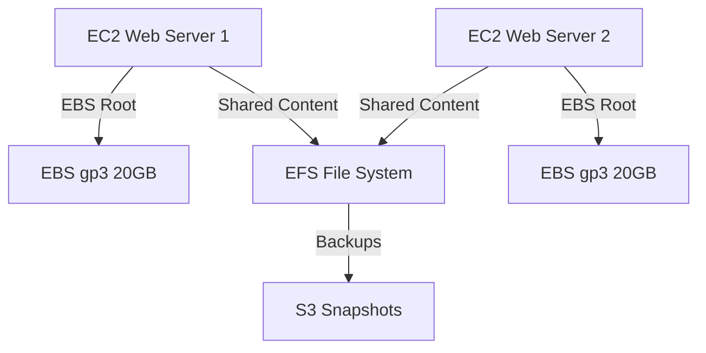

# BLOG #3: Amazon EBS vs EFS – Build Persistent & Shared Storage Like a Pro

> **Filename**: `_posts/2025-11-11-module-3-ebs-efs-mastery.md`  
> **Publish Date**: November 11, 2025  
> **Reading Time**: 10 minutes  
> **Author**: Monowar (AWS Certified Solutions Architect – Professional)

```markdown
---
title: "Amazon EBS vs EFS: Build Persistent & Shared Storage Like a Pro"
date: 2025-11-11
categories: aws storage ebs efs block-storage file-storage
tags: ebs efs snapshots multi-attach dlm encryption nfs
image: /assets/images/ebs-efs-hero.jpg
description: "Master Amazon EBS (block storage) and EFS (file storage). Learn volume types, snapshots, Multi-Attach, DLM, encryption, and how to mount EFS across multiple EC2 instances. Hands-on labs included."
---


> **"Storage is the foundation of any reliable cloud architecture."**  
> — *AWS Storage Services Guide, 2025*

---

## Amazon EBS: Block Storage for EC2

**Amazon Elastic Block Store (EBS)** provides **persistent, low-latency block-level storage** for **EC2 instances**.

Think of it as an **external SSD** you attach to your virtual server.

> **Official Docs**: [EBS User Guide](https://docs.aws.amazon.com/AWSEC2/latest/UserGuide/AmazonEBS.html)

---

## Key EBS Characteristics

| Feature | Description |
|--------|-------------|
| **Persistent** | Data survives instance stop/start |
| **AZ-Bound** | Volume must be in same AZ as EC2 |
| **Scalable** | Resize online with zero downtime |
| **Encrypted** | KMS-managed at rest & in transit |
| **Snapshots** | Point-in-time backups in S3 |

---

## EBS Volume Types (2025)

| Type | Performance | Use Case | IOPS / Throughput |
|------|-----------|----------|-------------------|
| **gp3** | SSD | Boot, dev/test | 16,000 IOPS, 1,000 MB/s |
| **io2 Block Express** | High-performance SSD | Databases | 260,000 IOPS, 4,000 MB/s |
| **st1** | HDD | Big data, logs | 500 MB/s throughput |
| **sc1** | Cold HDD | Archives | 250 MB/s |

> **gp3 is now default** — decouples IOPS from size  
> [EBS Volume Types](https://aws.amazon.com/ebs/volume-types/)

---

## Hands-On Lab 1: Create, Attach & Mount EBS

### Step 1: Create Volume
```bash
# Console: EC2 → Volumes → Create Volume
Type: gp3
Size: 8 GB
AZ: us-east-1a (same as EC2)
```

### Step 2: Attach to EC2
```bash
Actions → Attach Volume → Select Instance
```

### Step 3: Mount on Instance
```bash
ssh -i key.pem ec2-user@<public-ip>

# List devices
lsblk

# Format (first time only)
sudo mkfs -t ext4 /dev/xvdf

# Mount
sudo mkdir /data
sudo mount /dev/xvdf /data

# Verify
df -h
```

> **Unmount**: `sudo umount /data`

---

## EBS Snapshots: Incremental Backups

```bash
# Console: Volumes → Select → Actions → Create Snapshot
Name: EBS-Backup-Nov2025
```

- Stored in **S3** (you don’t see it)
- **Incremental** → only changed blocks
- **Cross-Region Copy** for DR

---

## EBS Multi-Attach (io2 Only)

Attach **one volume** to **up to 16 EC2 instances** in same AZ.

**Use Case**: Clustered databases (Oracle RAC, SAP HANA)

**Requirements**:
- `io2` volume
- Nitro-based instances
- Cluster-aware filesystem (e.g., OCFS2)

---

## Data Lifecycle Manager (DLM): Automated Backups

Automate **snapshot creation, retention, and deletion**.

### Hands-On: Create DLM Policy
```yaml
Policy Type: EBS Snapshot
Target: Volumes with tag Backup=true
Schedule: Every 12 hours
Retain: 7 snapshots
```

> [DLM Documentation](https://docs.aws.amazon.com/AWSEC2/latest/UserGuide/ebs-dlm.html)

---

## EBS Encryption

- **Enabled by default** on new volumes
- Uses **AWS KMS**
- Transparent to OS
- Snapshots & restored volumes encrypted

---

## Amazon EFS: Shared File Storage

**Elastic File System (EFS)** = **fully managed NFS** for **multiple EC2 instances**.

Think: **Network drive** accessible from **many servers**.

> [EFS Docs](https://docs.aws.amazon.com/efs/latest/ug/whatisefs.html)

---

## EFS Key Features

| Feature | Benefit |
|--------|--------|
| **Multi-AZ** | Survives AZ failure |
| **Petabyte-scale** | Grows automatically |
| **Concurrent Access** | 1000s of instances |
| **NFS Protocol** | Linux-native |
| **Encryption** | At rest & in transit |

---

## Hands-On Lab 2: Create & Mount EFS

### Step 1: Create EFS
```bash
# Console: EFS → Create File System
VPC: Your VPC
Performance: General Purpose
Throughput: Bursting
```

### Step 2: Mount on EC2
```bash
# Install NFS
sudo yum install -y nfs-utils

# Mount
sudo mkdir /efs
sudo mount -t efs fs-12345678:/ /efs

# Test
echo "Hello from $(hostname)" > /efs/test.txt
```

### Step 3: Mount on Second EC2
```bash
# Same commands
ls /efs
# → See test.txt from first instance!
```

---

## EBS vs EFS: Decision Matrix

| Feature | EBS | EFS |
|--------|-----|-----|
| **Type** | Block | File |
| **Access** | 1 instance (16 with Multi-Attach) | 1000s of instances |
| **Performance** | High IOPS | Scalable throughput |
| **Scope** | AZ | Region (multi-AZ) |
| **Protocol** | Block | NFS |
| **Best For** | Databases, boot volumes | Shared content, CMS, analytics |

> **Rule of Thumb**:  
> - **Single instance** → **EBS**  
> - **Multiple instances** → **EFS**

---

## Real-World Architecture: Web App with EBS + EFS



**Use Case**: WordPress, Magento, Jenkins shared workspace

---

## Key Takeaways

| Concept | Remember |
|--------|----------|
| **EBS** | Block storage, AZ-bound, high IOPS |
| **EFS** | NFS, multi-AZ, shared access |
| **Snapshots** | Incremental, stored in S3 |
| **DLM** | Automate backup lifecycle |
| **Encryption** | Enabled by default |
| **Multi-Attach** | io2 + Nitro only |

---

## Next: Amazon S3 Deep Dive

**Part 4** → [S3 Buckets, Versioning, CRR & Glacier](/posts/2025-11-18-module-4-s3-unlocked)

---

```

