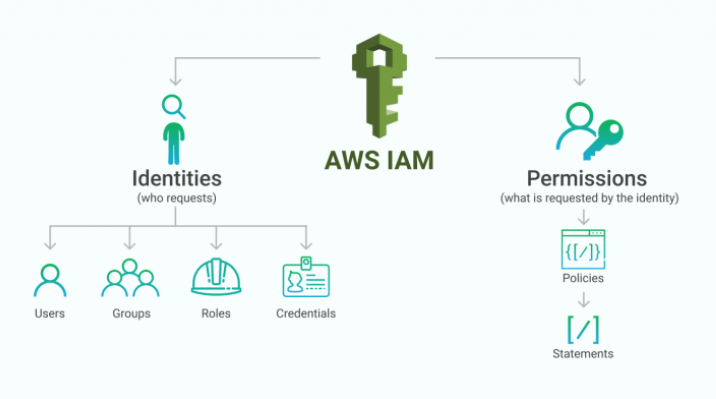

<!-- HERO BANNER -->

  <h1 style="font-size:3em; font-weight:800; margin-bottom:15px; text-shadow: 2px 2px 8px rgba(0,0,0,0.6);">AWS Cloud Computing Training</h1>
  

    Master the cloud from fundamentals to advanced AWS architecture.
    20 modules, 100+ practical labs, real-world examples.
  

  <a href="#module-index" style="
    display:inline-block;
    margin-top:20px;
    padding:14px 32px;
    background-color:#90ee90;
    color:#003300;
    font-weight:bold;
    border-radius:12px;
    text-decoration:none;
    font-family:'Poppins', 'Segoe UI', sans-serif;
    box-shadow:0 4px 12px rgba(0,0,0,0.3);
    transition: all 0.3s ease;
  " onmouseover="this.style.backgroundColor='#76d776'; this.style.transform='translateY(-2px)';"
    onmouseout="this.style.backgroundColor='#90ee90'; this.style.transform='translateY(0)';">
    Start Learning
  </a>

<!-- Load Google Font -->
<link href="https://fonts.googleapis.com/css2?family=Poppins:wght@500;600;700&display=swap" rel="stylesheet">

## Module Index
| No. |   | Preview |   | Module Title |   | Description |
|:---:|:-:|:--------:|:-:|:-------------|:-:|:-------------|
| 1 | |  | | [Introduction to Cloud Computing](/_posts/2025-10-28-module1-introduction-to-cloud-computing.md) | | Virtualization, Cloud models, Deployment types, AWS overview. |
| 2 | |  | | [Getting Started with AWS & EC2](/_posts/2025-10-29-module2-getting-started-with-aws-and-ec2.md) | | EC2 instances, AMIs, EBS, and key pair management. |
| 3 | |  | | [Elastic Block Store (EBS) & Elastic File System (EFS)](/_posts/2025-10-30-module3-elastic-block-store-ebs-and-elastic-file-system-efs.md) | | Persistent storage, snapshots, Multi-Attach, lifecycle. |
| 4 | |  | | [Amazon S3: Simple Storage Service](/_posts/2025-10-30-module4-amazon-s3-simple-storage-service.md) | | Object storage, versioning, lifecycle, replication. |
| 5 | |  | | [Networking with Amazon VPC](/_posts/2025-11-02-module5-networking-with-amazon-vpc.md) | | Custom VPCs, subnets, gateways, and routing. |
| 6 | |  | | [Elastic Load Balancing & Auto Scaling](/_posts/2025-11-03-module6-elastic-load-balancing-and-auto-scaling.md) | | Load balancing types, scaling policies, and health checks. |
| 7 | |  | | [Amazon Route 53 (DNS & Routing)](/_posts/2025-11-04-module7-amazon-route53-dns-and-traffic-routing.md) | | DNS routing, hosted zones, and failover strategies. |
| 8 | |  | | [AWS CloudFormation (Infrastructure as Code)](/_posts/2025-11-05-module8-aws-cloudformation-infrastructure-as-code.md) | | IaC templates, stacks, and automation. |
| 9 | |  | | [AWS Lambda & API Gateway (Serverless)](/_posts/2025-11-06-module9-aws-lambda-and-api-gateway-serverless-architecture.md) | | Build serverless APIs and event-driven apps. |
| 10 | |  | | [Amazon S3 & CloudFront (Global Delivery)](/_posts/2025-11-07-module10-amazon-s3-and-cloudfront-global-content-delivery.md) | | Static hosting, CDN distribution, HTTPS setup. |
| 11 | |  | | [AWS RDS & DynamoDB (Relational vs NoSQL)](/_posts/2025-11-08-module11-aws-rds-and-dynamodb-relational-vs-nosql.md) | | Database architecture, scaling, replication. |
| 12 | |  | | [Monitoring & Logging (CloudWatch, CloudTrail, Config)](/_posts/2025-11-09-module12-aws-monitoring-and-logging-cloudwatch-cloudtrail-config.md) | | Observability, audit logs, and compliance tools. |
| 13 | |  | | [Identity & Access Management (IAM)](/_posts/2025-11-10-module13-identity-and-access-management-iam.md) | | Users, roles, policies, and MFA. |
| 14 | |  | | [AWS Security & Encryption Services](/_posts/2025-11-11-module14-aws-security-and-encryption-services.md) | | Encryption, KMS, Secrets Manager, GuardDuty. |
| 15 | |  | | [Automation & DevOps Tools on AWS](/_posts/2025-11-12-module15-automation-and-devops-tools-on-aws.md) | | CI/CD pipelines, CodeCommit, CodeBuild, CodeDeploy. |
| 16 | |  | | [AWS Cost Management & Billing](/_posts/2025-11-13-module16-aws-cost-management-and-billing.md) | | Budgets, Cost Explorer, and cost optimization. |
| 17 | |  | | [High Availability and Fault Tolerance Architecture in AWS](/_posts/2025-11-14-module17-high-availability-and-fault-tolerance-architecture-in-aws.md) | | Backup automation, DR design, and recovery points. |
| 18 | |  | | [AWS Security Compliance and Governance Frameworks](/_posts/2025-11-14-module18-aws-security-compliance-and-governance-frameworks.md) | | Security, Compliance, and Governance. |
| 19 | |  | | [AWS Data Analytics](/_posts/2025-11-15-module19-aws-data-analytics.md) | | Pillars of architecture excellence and governance. |
| 20 | |  | | [AWS Architecture Design Patterns](/_posts/2025-11-15-module20-aws-architecture-design-patterns.md) | | Final project integrating all modules. |

---
## Learning Outcomes
By the end of this course, you will:
- Understand cloud service models and AWS core services.
- Design secure, scalable, and resilient cloud architectures.
- Automate deployments using Infrastructure as Code.
- Monitor, secure, and optimize workloads effectively.
- Complete a full end-to-end AWS solution project.

---
### Next Steps
- Visit each module post for videos and labs.
- Access GitHub repositories for templates and sample code.
- Subscribe for updates and future AWS specialty modules.

---

© 2025 Monowar Mukul — AWS Cloud Architecture Learning Series

