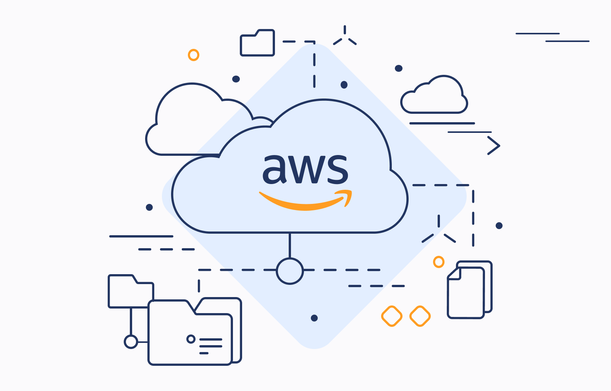

<!-- 🎯 HERO BANNER -->

  <h1 style="font-size:3em; font-weight:800; margin-bottom:15px; text-shadow: 2px 2px 8px rgba(0,0,0,0.6);">☁️ AWS Cloud Computing Training</h1>
  

    Master the cloud from fundamentals to advanced AWS architecture.  
    20 modules, 100+ practical labs, real-world examples.
  

  <a href="#module-index" style="display:inline-block; margin-top:20px; padding:14px 32px; background:linear-gradient(90deg, #ff9900, #ff6600); color:#fff; font-weight:bold; border-radius:12px; text-decoration:none; box-shadow: 0 4px 12px rgba(0,0,0,0.3); transition: all 0.3s;">
    🚀 Start Learning
  </a>

---

## 📘 Module Index

<table>
<tr>
<th>No.</th><th>Preview</th><th>Module Title</th><th>Description</th>
</tr>

<tr>
<td>1</td>
<td></td>
<td><a href="/_posts/2025-10-28-module1-introduction-to-cloud-computing.md">Introduction to Cloud Computing</a></td>
<td>Virtualization, Cloud models, Deployment types, AWS overview.</td>
</tr>

<tr>
<td>2</td>
<td></td>
<td><a href="/_posts/2025-10-29-module2-getting-started-with-aws-and-ec2.md">Getting Started with AWS & EC2</a></td>
<td>EC2 instances, AMIs, EBS, and key pair management.</td>
</tr>

<tr>
<td>3</td>
<td></td>
<td><a href="/_posts/2025-10-30-module3-elastic-block-store-ebs-and-elastic-file-system-efs.md">Elastic Block Store (EBS) & Elastic File System (EFS)</a></td>
<td>Persistent storage, snapshots, Multi-Attach, lifecycle.</td>
</tr>

<tr>
<td>4</td>
<td></td>
<td><a href="/_posts/2025-10-30-module4-amazon-s3-simple-storage-service.md">Amazon S3: Simple Storage Service</a></td>
<td>Object storage, versioning, lifecycle, replication.</td>
</tr>

<tr>
<td>5</td>
<td></td>
<td><a href="/_posts/2025-11-02-module5-networking-with-amazon-vpc.md">Networking with Amazon VPC</a></td>
<td>Custom VPCs, subnets, gateways, and routing.</td>
</tr>

<tr>
<td>6</td>
<td></td>
<td><a href="/_posts/2025-11-03-module6-elastic-load-balancing-and-auto-scaling.md">Elastic Load Balancing & Auto Scaling</a></td>
<td>Load balancing types, scaling policies, and health checks.</td>
</tr>

<tr>
<td>7</td>
<td></td>
<td><a href="/_posts/2025-11-04-module7-amazon-route53-dns-and-traffic-routing.md">Amazon Route 53 (DNS & Routing)</a></td>
<td>DNS routing, hosted zones, and failover strategies.</td>
</tr>

<tr>
<td>8</td>
<td></td>
<td><a href="/_posts/2025-11-05-module8-aws-cloudformation-infrastructure-as-code.md">AWS CloudFormation (Infrastructure as Code)</a></td>
<td>IaC templates, stacks, and automation.</td>
</tr>

<tr>
<td>9</td>
<td></td>
<td><a href="/_posts/2025-11-06-module9-aws-lambda-and-api-gateway-serverless-architecture.md">AWS Lambda & API Gateway (Serverless)</a></td>
<td>Build serverless APIs and event-driven apps.</td>
</tr>

<tr>
<td>10</td>
<td></td>
<td><a href="/_posts/2025-11-07-module10-amazon-s3-and-cloudfront-global-content-delivery.md">Amazon S3 & CloudFront (Global Delivery)</a></td>
<td>Static hosting, CDN distribution, HTTPS setup.</td>
</tr>

<tr>
<td>11</td>
<td></td>
<td><a href="/_posts/2025-11-08-module11-aws-rds-and-dynamodb-relational-vs-nosql.md">AWS RDS & DynamoDB (Relational vs NoSQL)</a></td>
<td>Database architecture, scaling, replication.</td>
</tr>

<tr>
<td>12</td>
<td></td>
<td><a href="/_posts/2025-11-09-module12-aws-monitoring-and-logging-cloudwatch-cloudtrail-config.md">Monitoring & Logging (CloudWatch, CloudTrail, Config)</a></td>
<td>Observability, audit logs, and compliance tools.</td>
</tr>

<tr>
<td>13</td>
<td></td>
<td><a href="/_posts/2025-11-10-module13-identity-and-access-management-iam.md">Identity & Access Management (IAM)</a></td>
<td>Users, roles, policies, and MFA.</td>
</tr>

<tr>
<td>14</td>
<td></td>
<td><a href="/_posts/2025-11-11-module14-aws-security-and-encryption-services.md">AWS Security & Encryption Services</a></td>
<td>Encryption, KMS, Secrets Manager, GuardDuty.</td>
</tr>

<tr>
<td>15</td>
<td></td>
<td><a href="/_posts/2025-11-12-module15-automation-and-devops-tools-on-aws.md">Automation & DevOps Tools on AWS</a></td>
<td>CI/CD pipelines, CodeCommit, CodeBuild, CodeDeploy.</td>
</tr>

<tr>
<td>16</td>
<td></td>
<td><a href="/_posts/2025-11-13-module16-aws-cost-management-and-billing.md">AWS Cost Management & Billing</a></td>
<td>Budgets, Cost Explorer, and cost optimization.</td>
</tr>

<tr>
<td>17</td>
<td></td>
<td><a href="/_posts/2025-11-14-module17-aws-backup-and-disaster-recovery.md">AWS Backup & Disaster Recovery</a></td>
<td>Backup automation, DR design, and recovery points.</td>
</tr>

<tr>
<td>18</td>
<td></td>
<td><a href="/_posts/2025-11-15-module18-hybrid-cloud-and-migration-strategies.md">Hybrid Cloud & Migration Strategies</a></td>
<td>Hybrid connectivity and data migration tools.</td>
</tr>

<tr>
<td>19</td>
<td></td>
<td><a href="/_posts/2025-11-16-module19-aws-well-architected-framework.md">AWS Well-Architected Framework</a></td>
<td>Pillars of architecture excellence and governance.</td>
</tr>

<tr>
<td>20</td>
<td></td>
<td><a href="/_posts/2025-11-17-module20-project-and-review.md">Project & Review</a></td>
<td>Final project integrating all modules.</td>
</tr>

</table>

## 🎯 Learning Outcomes
By the end of this course, you will:
- Understand cloud service models and AWS core services.  
- Design secure, scalable, and resilient cloud architectures.  
- Automate deployments using Infrastructure as Code.  
- Monitor, secure, and optimize workloads effectively.  
- Complete a full end-to-end AWS solution project.

---

### 🧭 Next Steps
- Visit each module post for videos and labs.  
- Access GitHub repositories for templates and sample code.  
- Subscribe for updates and future AWS specialty modules.

---

© 2025 Monowar Mukul — AWS Cloud Architecture Learning Series

